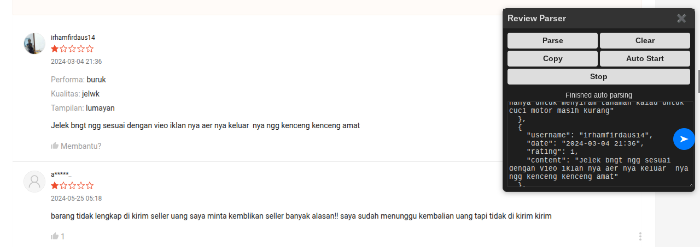

# 🦖 SREX – Shopee Review Extractor

A Tampermonkey userscript that automatically extracts Shopee Indonesia reviews (username, rating, date, and review text) into clean JSON format — supports auto-pagination, dark mode, and has a modern toggleable UI.

📌 [🇮🇩 Langsung ke Panduan Bahasa Indonesia](#📘-panduan-dalam-bahasa-indonesia)

---

## 📦 Features

- ✅ Parse **username**, **review text**, **rating (1–5 stars)**, and **date**  
- ✅ Supports **auto parse up to 5 pages**  
- ✅ Toggle UI panel with `Ctrl + 1`  
- ✅ Fully styled **dark/light mode** UI  
- ✅ Clipboard copy, clear, and stop controls  
- ✅ JSON output saved in-session (won’t duplicate)  

---

## 🧩 Installation

1. Install [**Tampermonkey**](https://www.tampermonkey.net/)  
2. Visit this script page on GreasyFork:  
   👉 **[Install on GreasyFork](https://greasyfork.org/en/scripts/YOUR-SCRIPT-ID)**  
3. Go to any Shopee Indonesia product page and click the **Reviews** tab.

---

## 🖥️ Usage

| Action         | Description                                                        |
| -------------- | ------------------------------------------------------------------ |
| ➤ Floating Btn | Toggle UI panel                                                    |
| **Parse**      | Manually extract visible reviews                                   |
| **Auto Start** | Wait 15 s, then auto-parse first 5 pages  (can be adjust)                         |
| **Stop**       | Immediately halt auto-parse                                        |
| **Clear**      | Wipe stored JSON and reset UI                                      |
| **Copy**       | Copy parsed JSON to clipboard                                      |
| `Ctrl + 1`     | Keyboard shortcut to toggle panel                                  |

---

## License
MIT License

Permission is hereby granted, free of charge, to any person obtaining a copy
of this software and associated documentation files (the “Software”), to deal
in the Software without restriction… (google for it)

## Legal Disclaimer
This project is not affiliated with Shopee. All Shopee trademarks and logos are
the property of their respective owners. This script is provided “as-is” without
warranty. We are not responsible for data inaccuracies, site changes, damages,
misuse, or legal issues arising from the use of this script.

## 🦖 SREX – Shopee Review Extractor

Sebuah *userscript* Tampermonkey yang secara otomatis mengekstrak ulasan produk dari Shopee Indonesia (username, rating, tanggal, dan isi ulasan) ke dalam format JSON yang rapi — mendukung auto-pagination, mode gelap, dan UI modern yang bisa di-toggle.

📌 [🇮🇩 Langsung ke Panduan Bahasa Indonesia](#📘-panduan-dalam-bahasa-indonesia)

---

## 📦 Fitur

- ✅ Mengambil **username**, **isi ulasan**, **rating (1–5 bintang)**, dan **tanggal**  
- ✅ Mendukung **otomatis parse hingga 5 halaman**  
- ✅ Panel UI bisa ditampilkan/sembunyikan dengan `Ctrl + 1`  
- ✅ UI sepenuhnya mendukung **mode terang/gelap**  
- ✅ Tersedia tombol **copy ke clipboard**, hapus, dan hentikan proses  
- ✅ Output JSON tersimpan di sesi (tidak akan duplikat)  

---

## 🧩 Instalasi

1. Pasang [**Tampermonkey**](https://www.tampermonkey.net/)  
2. Buka halaman skrip ini di GreasyFork:  
   👉 **[Pasang dari GreasyFork](https://greasyfork.org/en/scripts/YOUR-SCRIPT-ID)**  
3. Buka halaman produk Shopee Indonesia, lalu klik tab **Ulasan**.

---

## 🖥️ Penggunaan

| Aksi            | Deskripsi                                                              |
| --------------- | ---------------------------------------------------------------------- |
| ➤ Tombol Mengambang | Tampilkan/sembunyikan panel UI                                      |
| **Parse**       | Ambil ulasan yang terlihat secara manual                               |
| **Auto Start**  | Tunggu 15 detik, lalu otomatis parse 5 halaman pertama (bisa disesuaikan)                 |
| **Stop**        | Segera hentikan proses otomatisasi                                     |
| **Clear**       | Hapus data JSON yang tersimpan dan reset tampilan UI                   |
| **Copy**        | Salin data JSON hasil parse ke clipboard                               |
| `Ctrl + 1`      | Pintasan keyboard untuk menampilkan/menyembunyikan panel               |

---

## Lisensi
Lisensi MIT

Izin diberikan secara gratis kepada siapa pun untuk menggunakan
perangkat lunak ini dan dokumentasinya tanpa batasan… (silakan cari detailnya di Google)

## Penafian Hukum
Proyek ini tidak berafiliasi dengan Shopee. Semua merek dagang dan logo Shopee 
adalah milik masing-masing pemiliknya. Skrip ini disediakan "sebagaimana adanya" 
tanpa jaminan. Kami tidak bertanggung jawab atas kesalahan data, perubahan situs, 
kerusakan, penyalahgunaan, atau masalah hukum yang timbul dari penggunaan skrip ini.

